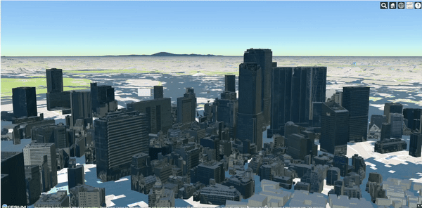

# Shibuya 3D City Viewer Demo


This project provides a 3D city viewer based on [Cesium](https://cesium.com/) showcasing 3D Tiles data for Shibuya, Tokyo, Japan.

## System Requirements

- [Node.js](https://nodejs.org/) (Version 18)
- [nvm](https://github.com/nvm-sh/nvm) (for managing Node.js versions)
- [npm](https://www.npmjs.com/) (Node.js package manager)

## Installation and Configuration Steps

### 1. Ensure nvm is Available
Verify that nvm is installed and check its version:
```bash
nvm --version
```

### 2. Install and Use Node.js 18
```bash
nvm install 18
nvm use 18
```

### 3. Check Node.js and npm Versions
```bash
node -v
npm -v
```

### 4. Install Dependencies
```bash
npm install cesium
npm install -g http-server
```

### 5. Prepare Data
Extract the 3D data into the current directory:
```bash
# e.g
unzip 13113_shibuya-ku_city_2023_3dtiles_mvt_1_op.zip
```

### 6. Run an HTTP Server
Navigate to the project directory and start the server:
```bash
# First terminal window
cd sibuya-demo
http-server ./public/ -p 8080 --cors
# Second terminal window
cd sibuya-demo
http-server ./ -p 3000 --cors
```

### 7. Verify Data Directories
Check the build paths for Cesium:
```bash
ls node_modules/cesium/Build/Cesium/
ls node_modules/cesium/Build/Cesium/Widgets/
```

### 8. Review and Edit `index.html`
Check or edit `index.html` to load the Cesium Viewer and specify the 3D Tilesets.

### 9. Dynamically Generate Tilesets (Optional)
If you need to automatically generate a Tileset URL, use `generate-tilesets.js`:
```bash
node generate-tilesets.js
```

## Launch the 3D City Viewer
Start the server and access:
```bash
http://localhost:3000/index.html # or server IP
```

## File Structure

- **index.html**: Main page containing the Cesium Viewer.
- **generate-tilesets.js**: Script for generating 3D Tilesets.
- **node_modules/**: Dependencies such as Cesium.
- **public/**: Public directory containing 3D data.

## Example Tilesets URLs
Some `tileset.json` files are pre-configured in `index.html` and can be adjusted as needed:
- `http://localhost:8080/13113_shibuya-ku_pref_2023_citygml_1_fld_pref_arakawa_kandagawa-zenpukujigawa-etc_3dtiles_l2/tileset.json`
- `http://localhost:8080/13113_shibuya-ku_pref_2023_citygml_1_fld_pref_furukawa_shibuyagawa-furukawa-etc_3dtiles_l1/tileset.json`

## Troubleshooting

1. **Unable to Start HTTP Server**: Ensure `http-server` is installed and no ports are in use.
2. **Cesium Viewer Fails to Display Tilesets**: Verify the `tileset.json` URL is accessible.

## References

- [Cesium Official Documentation](https://cesium.com/docs/)
- [HTTP Server NPM Package](https://www.npmjs.com/package/http-server)
